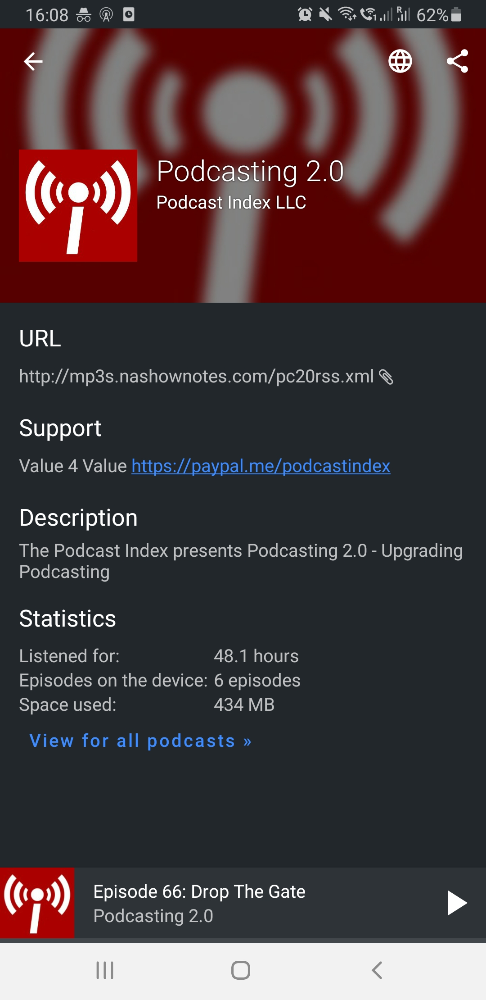
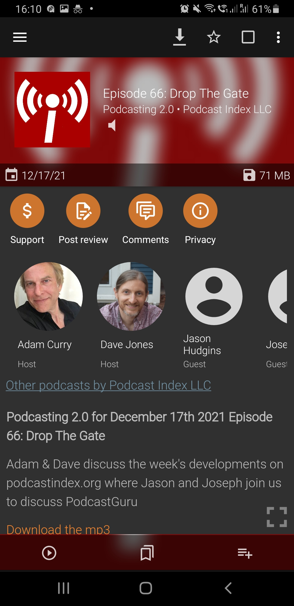
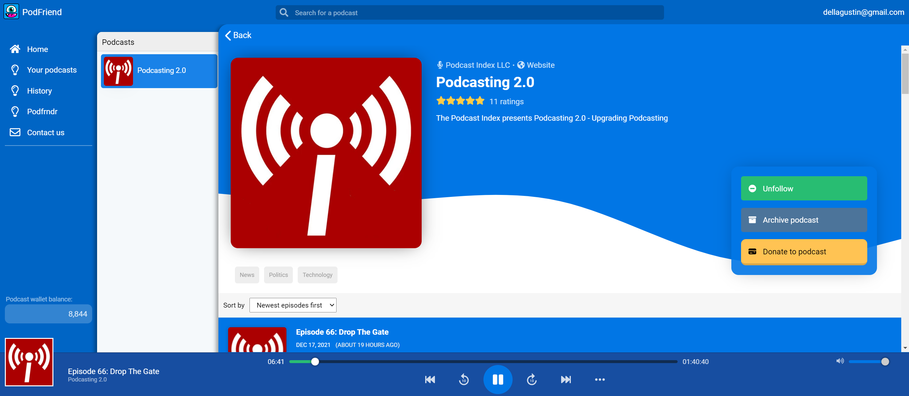
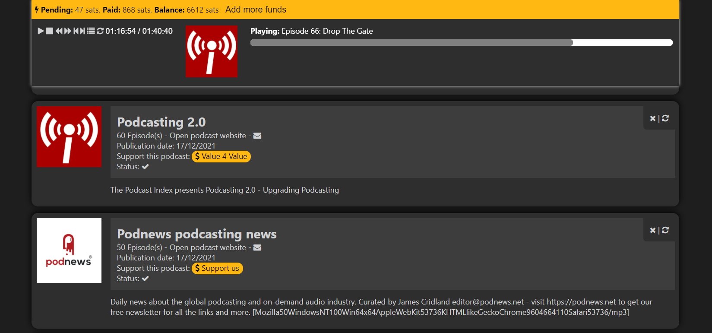

# Funding

Podcasting is a time demanding activity!

Be it a commercial podcast or a hobby, having the possibility to get financial support from listeners is an essential feature.

The podcast namespace tag `funding` provides a structured way to define how listeners can financially contribute with a podcast.

## Client Apps

Client apps should use the information on the funding tag to direct listeners to a payment / donations webpage.

This is how it looks like on supporting apps.

### AntennaPod

### Podcast Addict

### Podfriend

### podStation

